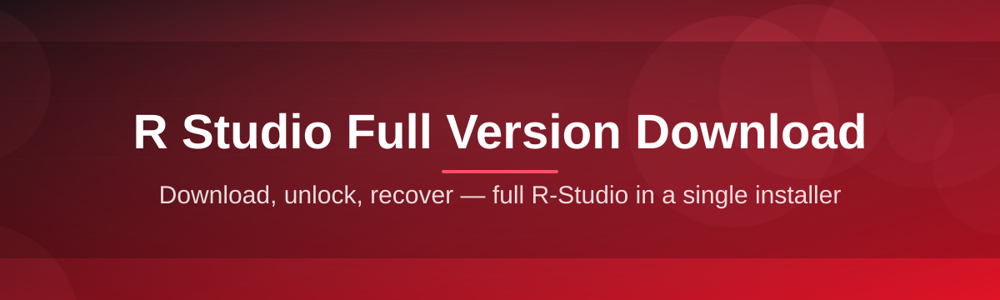
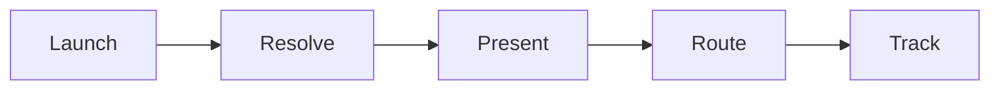

# r-studio-suite-manager 🧩🚀

  

| Requirement | Minimum |
|---|---|
| OS | Windows 10 (64-bit) or Windows 11 |
| RAM | 4 GB |
| Disk | 500 MB free |
| Dependencies | None — standalone binary |

*A single, honest launcher for grabbing and managing your R-Studio full version download — no clutter, no nonsense.*

  

---

## 🌱 Overview

I built **r-studio-suite-manager** because every time I searched for an "R-Studio full version download" I ended up wading through five mirror sites, two toolbars I didn't ask for, and a changelog written in a language I don't speak. That's it. That's the whole origin story. I wanted one clean landing page, one button, one build — and a tiny manager on top that keeps track of what version you're on and whether it's time to refresh it.

This project is a **thin, transparent orchestration layer** around the official R-Studio distribution flow. It doesn't repackage anything shady, it doesn't touch your registry behind your back, and it doesn't pretend to be smarter than it is. It just watches the release landing page, hands you a clean download path, and gives you a lightweight dashboard so you're not left guessing whether your install is current.

Who's this for? **Data-recovery folks, IT techs who reinstall this tool on client machines weekly, and hobbyists** who just want their R-Studio full version download to be a five-minute task instead of a scavenger hunt. If that's you — welcome, this was built with you specifically in mind.

---

## 🔥 What Makes This Tick

**One-click launch path** — the manager resolves the current build and drops you straight onto the download landing page, no detours.

**Version awareness** — it remembers what you last grabbed, so re-running it becomes a "check for updates" moment instead of a full re-download every time.

**Zero dependency footprint** — it's a standalone executable. No runtime installs, no background services phoning home.

**Clean-slate uninstall tracking** — logs exactly what was placed where, so removing it later is a non-event.

**Offline-friendly cache notes** — keeps a small local record of your last successful session so you're not re-discovering settings after a reboot.

**Theming that doesn't scream** — light and dark modes that were actually tuned by eye, not auto-generated.

**Keyboard-first navigation** — because reaching for a mouse for a five-second task is a crime against productivity.

**Honest logging** — every action writes a human-readable line, not a cryptic hash you'll never decode.

> [!TIP]
> If you only read one section of this README, read this one. The rest is context — this is the "why you'd actually use it" part.

---

## 🧭 Getting Off the Ground

1. **Visit the landing page** using the download button above — it's the only link this project will ever point you to.

2. **Grab the build** for your Windows version (10 or 11, both 64-bit).

3. **Run the executable** — no installer wizard marathon, it opens straight into the manager dashboard.

4. **Let it resolve your setup** — it checks your environment, confirms there's nothing conflicting, and you're off.

> [!NOTE]
> First launch may take a few extra seconds while the manager builds its local config file. Every launch after that is near-instant.

---

## 💻 System Requirements

| Component | Spec |
|---|---|
| **Operating System** | Windows 10 or Windows 11 (64-bit only) |
| **Processor** | Any x64 dual-core, 1.5 GHz+ |
| **Memory** | 4 GB RAM minimum, 8 GB comfortable |
| **Storage** | 500 MB free for the manager, more for R-Studio itself |
| **Dependencies** | **None.** It's fully standalone. |
| **Internet** | Required only for the initial download step |

> [!IMPORTANT]
> This tool does not run on macOS or Linux. It was purpose-built for the Windows ecosystem where R-Studio recovery workflows live.

---

## ⚙️ How It Works

The whole pipeline is intentionally short:

1. **Launch** the manager executable.

2. **Resolve** — it pings the landing page metadata to see what's current.

3. **Present** — you get a clean summary screen with version and size.

4. **Route** — you click through to the actual download landing page.

5. **Track** — the manager logs the session locally for next time.

---

## 🩹 Troubleshooting Corner

**Q: The manager says "no connection" but my internet is fine.**
A: Corporate proxies sometimes block the metadata check. Try running it off a personal network once to confirm.

**Q: My antivirus flagged the executable.**
A: Standalone unsigned binaries sometimes trigger heuristic false positives. Check the file hash against the landing page listing before trusting or discarding the warning.

**Q: I downloaded R-Studio but the manager still shows an old version number.**
A: The local cache only refreshes on next launch — close and reopen the manager.

**Q: Dark mode looks washed out on my monitor.**
A: Older sRGB panels render our accent color slightly differently — a settings-level contrast slider is planned.

**Q: Can I run this on a VM?**
A: Yes, as long as the VM is Windows 10/11 64-bit with normal internet access.

> [!WARNING]
> Never run the manager from a network share with write restrictions — it needs to write its small local log file or the session tracker will silently fail.

---

## 🎨 UI / UX Details

<strong>Keyboard shortcuts</strong>

- `Ctrl + R` — refresh version check
- `Ctrl + D` — jump to download landing page
- `Ctrl + L` — open local session log
- `Esc` — close dashboard overlay

<strong>Themes & settings</strong>

- Light / Dark / Follows-Windows-Theme
- Adjustable font scale (small, default, large)
- Toggle for startup auto-check

> Small UI, but every pixel was placed on purpose — nothing here is a default template left un-edited.

---

## 🤝 Contributing & Community

This started as a personal itch-scratch project, and it genuinely lights me up seeing it grow.

- Open an issue for bugs or UX friction points
- Pull requests welcome — keep changes focused and documented
- Discussions tab is open for feature ideas around R-Studio full version download workflows

  

---

## 📜 License

Released under the [MIT License](LICENSE), 2026.

---

## ⚠️ Disclaimer

> This manager is an independent utility. It is not affiliated with, endorsed by, or officially connected to the R-Studio brand. It simply streamlines access to the official download landing page and offers a lightweight local companion dashboard.

---

## 🗒️ Changelog

**v2026.3**
- Added dark-mode contrast fix
- Faster metadata resolve step

**v2026.2**
- Introduced session log viewer
- Keyboard shortcut overhaul

**v2026.1**
- Initial public release
- Core version-tracking dashboard shipped

